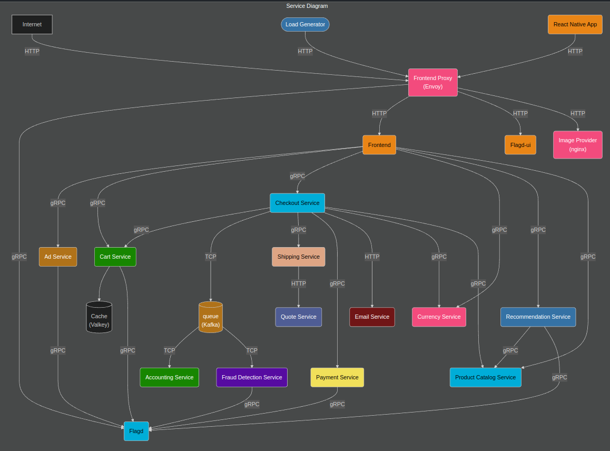
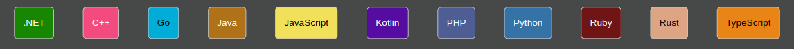

> # `Repo is in-progress`


---
# TraceMyPods (opentelemetry.io) 

**TraceMyPods** is a Kubernetes setup for OpenTelemetry, designed to help you collect, visualize, and analyze traces from your Kubernetes workloads. This project provides a simple deployment of OpenTelemetry to monitor your applications and services, allowing you to explore observability best practices and improve your DevOps skills.




## Project Overview

- **Kubernetes**: Container orchestration platform.
- **OpenTelemetry**: A set of APIs, libraries, agents, and instrumentation to provide observability into the performance of your applications.
- **Traces**: Visualize the lifecycle of your requests as they travel across your distributed system.

This repository aims to guide you through the process of setting up OpenTelemetry on Kubernetes, collecting metrics and traces, and using them for improved debugging and performance analysis.

## Features

- Easy deployment of OpenTelemetry Collector on Kubernetes.
- Integration with Prometheus, Grafana, and other monitoring tools.
- Real-time trace visualization for Kubernetes pods and services.
- Kubernetes-native observability stack.

## Prerequisites

- Kubernetes 1.18+ cluster
- kubectl (Kubernetes CLI)
- Helm (for managing Kubernetes charts)
- OpenTelemetry Collector setup
- Prometheus and Grafana for visualizing metrics and traces

## Installation



### 1. Clone the Repository
```bash
git clone https://github.com/ahmadrazalab/TraceMyPods.git
cd TraceMyPods
```

### 2. Set up OpenTelemetry on Kubernetes
You can deploy OpenTelemetry using Helm charts to easily integrate it with your existing Kubernetes setup.

```bash
helm install opentelemetry-collector open-telemetry/opentelemetry-operator
```

### 3. Configure OpenTelemetry Collector
Once the OpenTelemetry Collector is deployed, configure it to send trace data to your observability tools like Prometheus, Grafana, or Jaeger.

### 4. Verify Installation
Ensure your pods are receiving traces and metrics by checking the OpenTelemetry logs and the data visualized in your chosen tools (e.g., Grafana).

## Usage

Once the setup is complete, you'll be able to see traces in your monitoring tools. Use the OpenTelemetry SDKs and instrumentation libraries to add tracing to your applications running in Kubernetes.

## Contributing

Feel free to fork this repository and make your improvements! Please submit a pull request with a clear description of your changes.

## License

Distributed under the MIT License. See LICENSE for more information.

---

For more information on OpenTelemetry, visit the [official documentation](https://opentelemetry.io/docs/).
